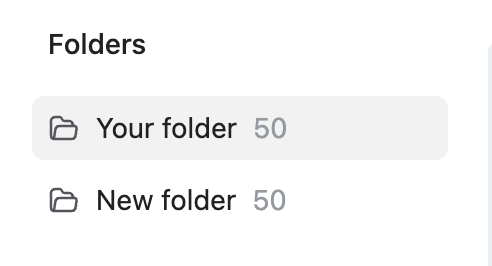
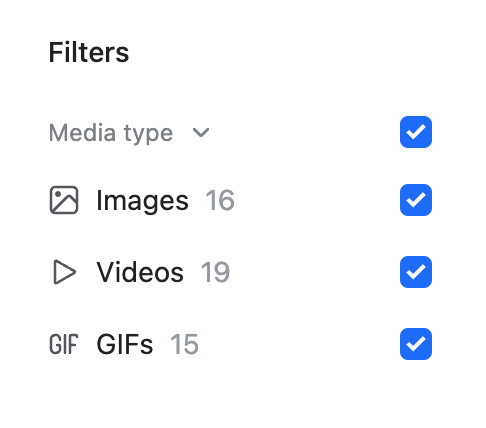
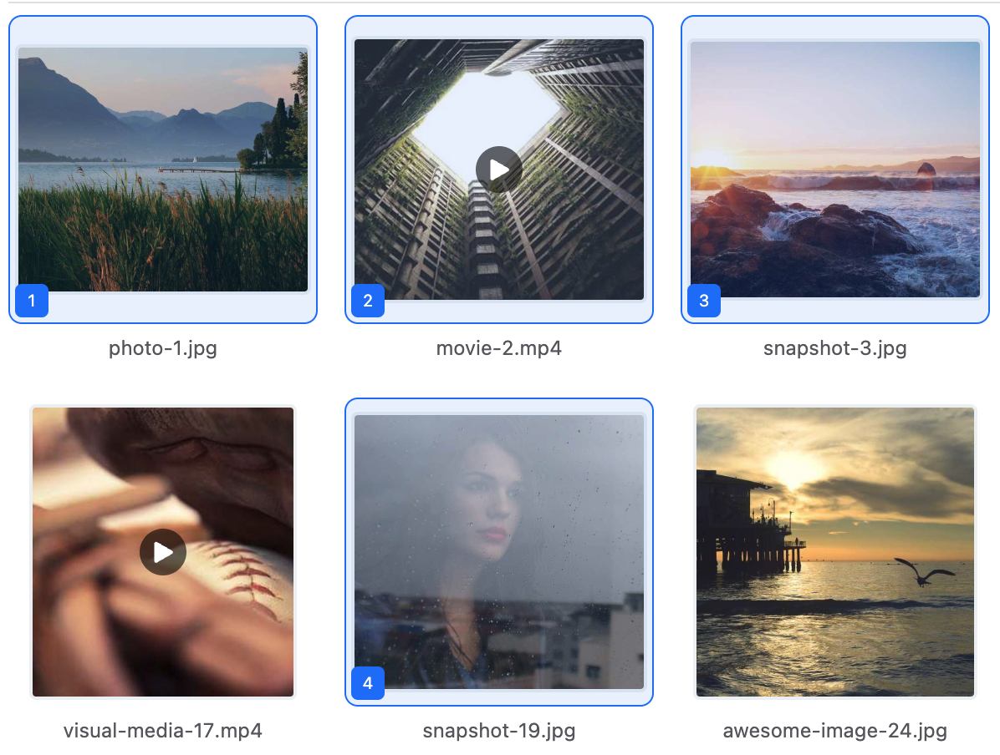
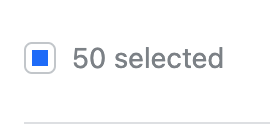
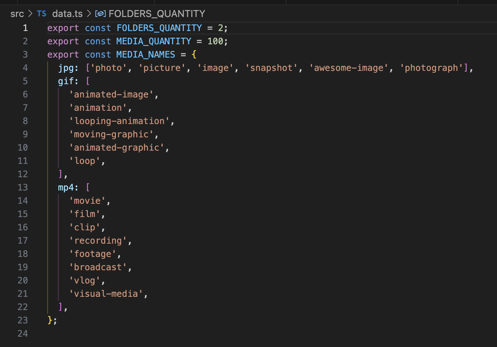

# Media grid App

## How to run?

```
npm i -g pnpm
pnpm run dev
```

## Features?

### Changing folders:



- Just press on another folder and you will see the media from that respective folder

### Filtering by media type:



- Clicking on Media type will show or hide the filters
- Clicking on Media type checkbox will add or remove all filters
- Clicking on Images, Videos or GIfs filters, will add or remove the respective filter

### Searching by media name:


- Type the name of the searched media and you will get the results that include the query

### Selecting media:



- Clicking on media will select it
- Clicking again, will deselect

### Select all media:



- Clicking on the top bar cubic checkbox will select or deselect all current shown media

### Move selected media to other folders:


- Selecting media and then pressing on the topbar select will provide the folders to which you can move the selected media

### Remove selected media:


- Selecting media and then pressing the bin button will remove the selected media

### Expand media:


- Clicking on the expand icon when hovering on media will expand the respective media
- Clicking again anywhere on the screen will exit the expanded state

### Rename media:


- Clicking on the edit icon on the respective media will provide you with a input where you can type the new media name
- Clicking again outside of the input or pressing Enter will rename the file

## Data?

You can manipulate the number of media, folders, names of the files from the `src/data.ts` file


